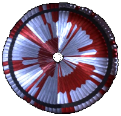
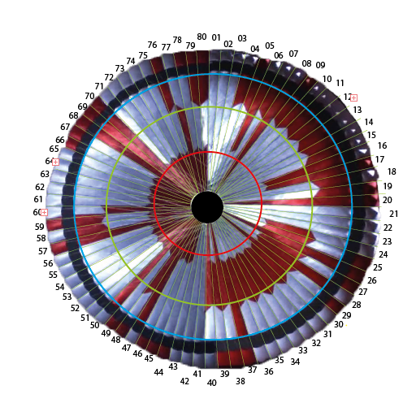
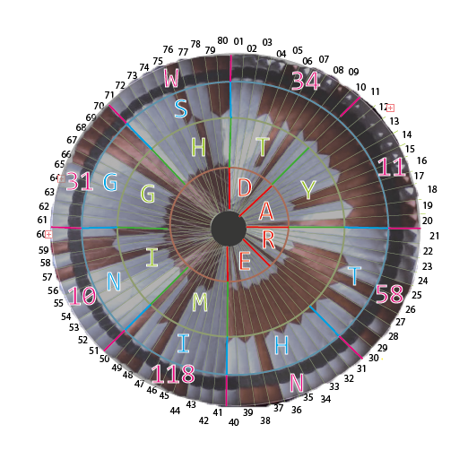

# NASA Mars 2020 Perseverance Rover Parachute Riddle

[NASA's Mars 2020 Perseverance rover](https://mars.nasa.gov/mars2020/) used a parachute during landing on mars. That parachute featured an intricate design, which I did not pay any attention to, when I first watched the [video of the descent and touchdown](https://www.youtube.com/watch?v=4czjS9h4Fpg). Some time later, during some press conference, NASA gave a hint, there would be a hidden message on the parachute. Picked this up in some news article about the parachute code and how it was solved within hours. So that did pick my interest and looking at the [NASA coverage](https://mars.nasa.gov/news/8870/nasas-mars-perseverance-rover-provides-front-row-seat-to-landing-first-audio-recording-of-red-planet/), armed with the spoilers from the news, I started my attempt at decoding that unresistable riddle.

## What does the parachute look like anyway

NASA thankfully puts a lot of [raw images](https://mars.nasa.gov/mars2020/multimedia/raw-images/) on their mission site. The chute is visible in the video coverage as well, but well, I grabbed some of those raws.


The pattern of the chute is clearly visible, but some part of the chute gets obscured. Fortunately the chute is turning and i photoshopped a bit to get a view of the complete parachute.



## Parachute segmented
 Getting all giddy looking at the parachute and counting colors, I moved on to draw some lines and numbers on that.



The chute consists of 80 segments and the pattern is divided into 4 circular stretches. Well, I picked the top for starting the numbering by random choice.

## Parachute in binary
Going with the news article spoilers, the pattern and colors should be bits and chunk to ascii. By doing some tedious counting, the following data block results.

```
seg    00000000011111111112222222222333333333344444444445555555555666666666677777777778
seg    12345678901234567890123456789012345678901234567890123456789012345678901234567890

rings inner to outer (W)hite, (R)ed
ring 0 WWWWWWWRWWWWWWWWWWWRWWWWWRWWRWWWWWWWWRWRWWWRRRRRRRRRRRRRRRRRRRRRRRRRRRRRRRRRRRRR
ring 1 WWWWWRWRWWWWWWWRRWWRWWWRRRRRRRRRRRRRRRRRWWWWWWRRWRWWWWWWRWWRWWWWWWWRRRWWWWWWRWWW
ring 2 WWWRRRRRRRRRRRRRRRRRWWWWWRWRWWWWWWWWRWWWWWWWWWRWWRWWWWWWRRRWWWWWWWWRRRWWWWWRWWRR
outer  WWWWRWWWRWWWWWWWRWRRWWWWRRRWRWWWWWWWRRRWWWWRRRWRRWWWWWWWRWRWWWWWWRRRRRWWWWWRWRRR


rings inner to outer White(0), Red(1)
ring 0 00000001000000000001000001001000000001010001111111111111111111111111111111111111
ring 1 00000101000000011001000111111111111111110000001101000000100100000001110000001000
ring 2 00011111111111111111000001010000000010000000001001000000111000000001110000010011
outer  00001000100000001011000011101000000011100001110110000000101000000111110000010111
```

## Bit rotation
Looks like binary, nice. Looks regular as well and 80 makes for nice 8-bit or 10-bit chunks. The start is random, meaning the chute is spinning and who knows where the top is. So that might need some bit rotation. Python to the rescue, i wrote some [lines of decode](decode_chute.py) and got some [output](output.txt).

```
00000001000000000001000001001000000001010001111111111111111111111111111111111111
00000010000000000010000010010000000010100011111111111111111111111111111111111110
00000100000000000100000100100000000101000111111111111111111111111111111111111100
00001000000000001000001001000000001010001111111111111111111111111111111111111000
00010000000000010000010010000000010100011111111111111111111111111111111111110000
00100000000000100000100100000000101000111111111111111111111111111111111111100000
01000000000001000001001000000001010001111111111111111111111111111111111111000000
10000000000010000010010000000010100011111111111111111111111111111111111110000000
00000000000100000100100000000101000111111111111111111111111111111111111100000001
00000000001000001001000000001010001111111111111111111111111111111111111000000010
00000000010000010010000000010100011111111111111111111111111111111111110000000100
00000000100000100100000000101000111111111111111111111111111111111111100000001000
00000001000001001000000001010001111111111111111111111111111111111111000000010000
00000010000010010000000010100011111111111111111111111111111111111110000000100000
00000100000100100000000101000111111111111111111111111111111111111100000001000000
00001000001001000000001010001111111111111111111111111111111111111000000010000000
00010000010010000000010100011111111111111111111111111111111111110000000100000000
00100000100100000000101000111111111111111111111111111111111111100000001000000000
01000001001000000001010001111111111111111111111111111111111111000000010000000000
10000010010000000010100011111111111111111111111111111111111110000000100000000000
00000100100000000101000111111111111111111111111111111111111100000001000000000001
00001001000000001010001111111111111111111111111111111111111000000010000000000010
00010010000000010100011111111111111111111111111111111111110000000100000000000100
00100100000000101000111111111111111111111111111111111111100000001000000000001000
01001000000001010001111111111111111111111111111111111111000000010000000000010000
10010000000010100011111111111111111111111111111111111110000000100000000000100000
00100000000101000111111111111111111111111111111111111100000001000000000001000001
01000000001010001111111111111111111111111111111111111000000010000000000010000010
10000000010100011111111111111111111111111111111111110000000100000000000100000100
00000000101000111111111111111111111111111111111111100000001000000000001000001001
00000001010001111111111111111111111111111111111111000000010000000000010000010010
00000010100011111111111111111111111111111111111110000000100000000000100000100100
00000101000111111111111111111111111111111111111100000001000000000001000001001000
00001010001111111111111111111111111111111111111000000010000000000010000010010000
00010100011111111111111111111111111111111111110000000100000000000100000100100000
00101000111111111111111111111111111111111111100000001000000000001000001001000000
01010001111111111111111111111111111111111111000000010000000000010000010010000000
10100011111111111111111111111111111111111110000000100000000000100000100100000000
01000111111111111111111111111111111111111100000001000000000001000001001000000001
10001111111111111111111111111111111111111000000010000000000010000010010000000010
00011111111111111111111111111111111111110000000100000000000100000100100000000101
00111111111111111111111111111111111111100000001000000000001000001001000000001010
01111111111111111111111111111111111111000000010000000000010000010010000000010100
11111111111111111111111111111111111110000000100000000000100000100100000000101000
11111111111111111111111111111111111100000001000000000001000001001000000001010001
11111111111111111111111111111111111000000010000000000010000010010000000010100011
11111111111111111111111111111111110000000100000000000100000100100000000101000111
11111111111111111111111111111111100000001000000000001000001001000000001010001111
11111111111111111111111111111111000000010000000000010000010010000000010100011111
11111111111111111111111111111110000000100000000000100000100100000000101000111111
11111111111111111111111111111100000001000000000001000001001000000001010001111111
11111111111111111111111111111000000010000000000010000010010000000010100011111111
11111111111111111111111111110000000100000000000100000100100000000101000111111111
11111111111111111111111111100000001000000000001000001001000000001010001111111111
11111111111111111111111111000000010000000000010000010010000000010100011111111111
11111111111111111111111110000000100000000000100000100100000000101000111111111111
11111111111111111111111100000001000000000001000001001000000001010001111111111111
11111111111111111111111000000010000000000010000010010000000010100011111111111111
11111111111111111111110000000100000000000100000100100000000101000111111111111111
11111111111111111111100000001000000000001000001001000000001010001111111111111111
11111111111111111111000000010000000000010000010010000000010100011111111111111111
11111111111111111110000000100000000000100000100100000000101000111111111111111111
11111111111111111100000001000000000001000001001000000001010001111111111111111111
11111111111111111000000010000000000010000010010000000010100011111111111111111111
11111111111111110000000100000000000100000100100000000101000111111111111111111111
11111111111111100000001000000000001000001001000000001010001111111111111111111111
11111111111111000000010000000000010000010010000000010100011111111111111111111111
11111111111110000000100000000000100000100100000000101000111111111111111111111111
11111111111100000001000000000001000001001000000001010001111111111111111111111111
11111111111000000010000000000010000010010000000010100011111111111111111111111111
11111111110000000100000000000100000100100000000101000111111111111111111111111111
11111111100000001000000000001000001001000000001010001111111111111111111111111111
11111111000000010000000000010000010010000000010100011111111111111111111111111111
11111110000000100000000000100000100100000000101000111111111111111111111111111111
11111100000001000000000001000001001000000001010001111111111111111111111111111111
11111000000010000000000010000010010000000010100011111111111111111111111111111111
11110000000100000000000100000100100000000101000111111111111111111111111111111111
11100000001000000000001000001001000000001010001111111111111111111111111111111111
11000000010000000000010000010010000000010100011111111111111111111111111111111111
10000000100000000000100000100100000000101000111111111111111111111111111111111111
```

Isn't that nice looking? The shifts look like the randomly picked start position makes for a good start. 1 in 80 :D
`
## Scanning offset and shift
Nevertheless in the decode I ran it for each of the 80 possible start position and broke each ring code into chunks of 10 bit to parse as number. Then the news spoiler was about some offset to get ascii, so doing that and scanning for offsets up to 128, filtering for at least 3 uppercase Letters, I got some results with ascii offset 64 in the [output](output.txt).

```
64 0 DARE¿ппп [4, 1, 18, 5, 127, 1023, 1023, 1023]
64 10 ARE¿пппD [1, 18, 5, 127, 1023, 1023, 1023, 4]
64 20 RE¿пппDA [18, 5, 127, 1023, 1023, 1023, 4, 1]
64 30 E¿пппDAR [5, 127, 1023, 1023, 1023, 4, 1, 18]
64 40 ¿пппDARE [127, 1023, 1023, 1023, 4, 1, 18, 5]
64 50 пппDARE¿ [1023, 1023, 1023, 4, 1, 18, 5, 127]
64 60 ппDARE¿п [1023, 1023, 4, 1, 18, 5, 127, 1023]
64 70 пDARE¿пп [1023, 4, 1, 18, 5, 127, 1023, 1023]

64 0 TY¿пMIGH [20, 25, 127, 1023, 13, 9, 7, 8]
64 1 hrĿоZRNP [40, 50, 255, 1022, 26, 18, 14, 16]
64 10 Y¿пMIGHT [25, 127, 1023, 13, 9, 7, 8, 20]
64 11 rĿоZRNPh [50, 255, 1022, 26, 18, 14, 16, 40]
64 20 ¿пMIGHTY [127, 1023, 13, 9, 7, 8, 20, 25]
64 21 ĿоZRNPhr [255, 1022, 26, 18, 14, 16, 40, 50]
64 30 пMIGHTY¿ [1023, 13, 9, 7, 8, 20, 25, 127]
64 31 оZRNPhrĿ [1022, 26, 18, 14, 16, 40, 50, 255]
64 40 MIGHTY¿п [13, 9, 7, 8, 20, 25, 127, 1023]
64 41 ZRNPhrĿо [26, 18, 14, 16, 40, 50, 255, 1022]
64 50 IGHTY¿пM [9, 7, 8, 20, 25, 127, 1023, 13]
64 51 RNPhrĿоZ [18, 14, 16, 40, 50, 255, 1022, 26]
64 60 GHTY¿пMI [7, 8, 20, 25, 127, 1023, 13, 9]
64 61 NPhrĿоZR [14, 16, 40, 50, 255, 1022, 26, 18]
64 70 HTY¿пMIG [8, 20, 25, 127, 1023, 13, 9, 7]
64 71 PhrĿоZRN [16, 40, 50, 255, 1022, 26, 18, 14]

64 0 ¿пTHINGS [127, 1023, 20, 8, 9, 14, 7, 19]
64 10 пTHINGS¿ [1023, 20, 8, 9, 14, 7, 19, 127]
64 20 THINGS¿п [20, 8, 9, 14, 7, 19, 127, 1023]
64 30 HINGS¿пT [8, 9, 14, 7, 19, 127, 1023, 20]
64 40 INGS¿пTH [9, 14, 7, 19, 127, 1023, 20, 8]
64 50 NGS¿пTHI [14, 7, 19, 127, 1023, 20, 8, 9]
64 60 GS¿пTHIN [7, 19, 127, 1023, 20, 8, 9, 14]
64 70 S¿пTHING [19, 127, 1023, 20, 8, 9, 14, 7]

64 0 bKzN¶J_W [34, 11, 58, 14, 118, 10, 31, 23]
64 9 EɝG{EOɋɑ [5, 541, 7, 59, 5, 15, 523, 529]
64 10 KzN¶J_Wb [11, 58, 14, 118, 10, 31, 23, 34]
64 19 ɝG{EOɋɑE [541, 7, 59, 5, 15, 523, 529, 5]
64 20 zN¶J_WbK [58, 14, 118, 10, 31, 23, 34, 11]
64 29 G{EOɋɑEɝ [7, 59, 5, 15, 523, 529, 5, 541]
64 30 N¶J_WbKz [14, 118, 10, 31, 23, 34, 11, 58]
64 39 {EOɋɑEɝG [59, 5, 15, 523, 529, 5, 541, 7]
64 40 ¶J_WbKzN [118, 10, 31, 23, 34, 11, 58, 14]
64 49 EOɋɑEɝG{ [5, 15, 523, 529, 5, 541, 7, 59]
64 50 J_WbKzN¶ [10, 31, 23, 34, 11, 58, 14, 118]
64 59 OɋɑEɝG{E [15, 523, 529, 5, 541, 7, 59, 5]
64 60 _WbKzN¶J [31, 23, 34, 11, 58, 14, 118, 10]
64 69 ɋɑEɝG{EO [523, 529, 5, 541, 7, 59, 5, 15]
64 70 WbKzN¶J_ [23, 34, 11, 58, 14, 118, 10, 31]
64 79 ɑEɝG{EOɋ [529, 5, 541, 7, 59, 5, 15, 523]
```

This is the printout in blocks for each ring code. First is the ascii offset 64, then the shift, the text(with offset) and the raw numbers (without offset)

## The Hidden Message

Lucky me, there is the first word at shift 0. Second word on shift 40 and third at 20. Chunksize 10 following, the words continue in the next ring where the former left.



```
64 0 DARE¿ппп [4, 1, 18, 5, 127, 1023, 1023, 1023]

64 40 MIGHTY¿п [13, 9, 7, 8, 20, 25, 127, 1023]

64 20 THINGS¿п [20, 8, 9, 14, 7, 19, 127, 1023]

64 0 bKzN¶J_W [34, 11, 58, 14, 118, 10, 31, 23]
```

So there it is, DARE MIGHTY THINGS.

Then that one in the outer ring. Being lucky again this starts at 0 and has 4 letters, thus passing the filter. Looking at N, W and the 2 groups of 3 letters, this might pass for geo coordinates if the letters are substituted for their raw source numbers. This is giving [34°11'58"N 118°10'31"W](https://www.google.com/maps/place/34%C2%B011'58.0%22N+118%C2%B010'31.0%22W). News says this is the JPL lab where major portions of work on Perseverance were done.

Well, looking at the sketch, It looks like simple barcode. Why couldn't silly me read this in the first place, when I saw the parachute in the footage ;)